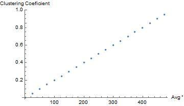
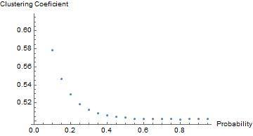
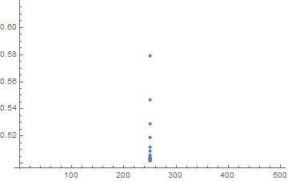

# Complex Networks Report - Project 1

**Professor**: Francisco João Duarte Cordeiro Correia dos Santos

**Group**: 10

**Students**:

  - Gonçalo Cardoso Gaspar (58803)
  - João Nuno Estevão Fidalgo Ferreira Alves (79155)
  - Rodrigo André Moreira Bernardo (78942)

## Abstract
In this report we summarize our work done for the first project of the Complex
Networks course.
For this project we made a small library over the boost graph library for C++
that allows to calculate metrics and generate graphs following certain models.
Furthermore, we did a small analysis of the *clustering coefficient* metric for
graphs that are governed by the Erdős-Renyi and Watz-Strogatz models.

## Objectives
Learn to use a library for creation, manipulation and analysis of graphs.
Learn and implement metrics and models of graphs.
Analyze graphs by some of the implemented metrics.

## What we did
To reach our goals we proposed to create a library of algorithms over graphs on
top of the boost graph library for C++.
We implemented the metrics
*average path length*,
*degree distribution*,
*closeness centrality*,
*clustering coefficient* and
*betweeness centrality*.
Apart from that, we also implemented algorithms for the instantiation of graphs
following the
Erdős-Renyi,
[Watz-Strogatz](https://fenix.tecnico.ulisboa.pt/downloadFile/1407993358848081/WattsStrogratz.Nature98.pdf)
and [Barabási-Albert](https://fenix.tecnico.ulisboa.pt/downloadFile/1407993358848079/BarabasiAlbert_Science99.pdf) models.

## Analysis
Apart from the creation of the library, we also made some graph analysis
applying the metrics and models we implemented.

### *Clustering coefficient*

#### *Local clustering coefficient*

The local *clustering coefficient* of a node $i$, $C_i$, in an undirected graph
is defined as twice the number of edges among its neighbours, $e_i$, divided by
the maximum possible amount of links between them:

> $C_i = \frac{2e_i}{k_i (k_i - 1)}$

where $k_i$ is the degree of node $i$.

#### *Network average clustering coefficient*

The overall level of *clustering* in a network of size $N$ is then defined (as
by Watts and Strogatz[2]) as the average of the *local clustering coefficients*
of all its the nodes:

> $C = \frac{1}{N}\sum_{i=1}^{N}C_i$

#### *Clustering coefficient* applied to the Erdős-Rényi model

The Erdõs-Rényi model is a model for generating random graphs.
It has two parameters: *n*, the number of nodes of the graph, and *p* the
probability that each pair of nodes in the graph is connected.
This means that the graph will be fully disconnected for p = 0 and fully
connected por p = 1.

By intuition, if the degree $k_i$ of node $i$ is increased it would be expected
for its local *clustering coefficient* to decrease, since the value of $E_i$ would
be at most increased by $k_i$ and the growth of the denominator is quadratic.
On the other hand it is obvious that the *network clustering coefficient* is
maximum for a fully connected graph.

Applying this metric to a set of twenty graphs following the Erdõs-Rényi model,
we obtain the plot in figure 1.

{ width=9cm }

The plot shows that in a random graph the global *clustering coefficient* is
directly proportional to the average degree.
While the *local clustering coefficient* of a node decreases when a link is added
to it, the increase in the *local clustering coefficients* on the other nodes
compensates and the *network clustering coefficient* increases.

#### *Clustering coefficient* applied to the Watz and Strogatz model

The Watz and Strogatz model describes how to generate random graphs with
small-world properties. It starts with a fully connected regular graph of $N$
nodes and then rewires each edge with probability $p$.
If $p = 0$, the graph would remain equal to it's initial form, while for $p = 1$
every edge would be rewired.

A fully connected graph has the maximum *clustering coefficient* possible, so it
is expected a drop on the *clustering coefficient* the more we rewire the edges
(i.e. for higher values of $p$) (figure 2).

{ width=9cm }

It is important to note that for graphs generated by this model the average
degree doesn't change for different values of $p$, meaning that the *network
clustering coeficient* is independent from the average degree (figure 3).

{
width=9cm }

## Conclusion

In short, this project allowed us to gain a better sense of some of the metrics
and models that are used today to analyze networks.
Certainly the experience and knowledge we have gained will be useful to apply to
our second project of the course.
